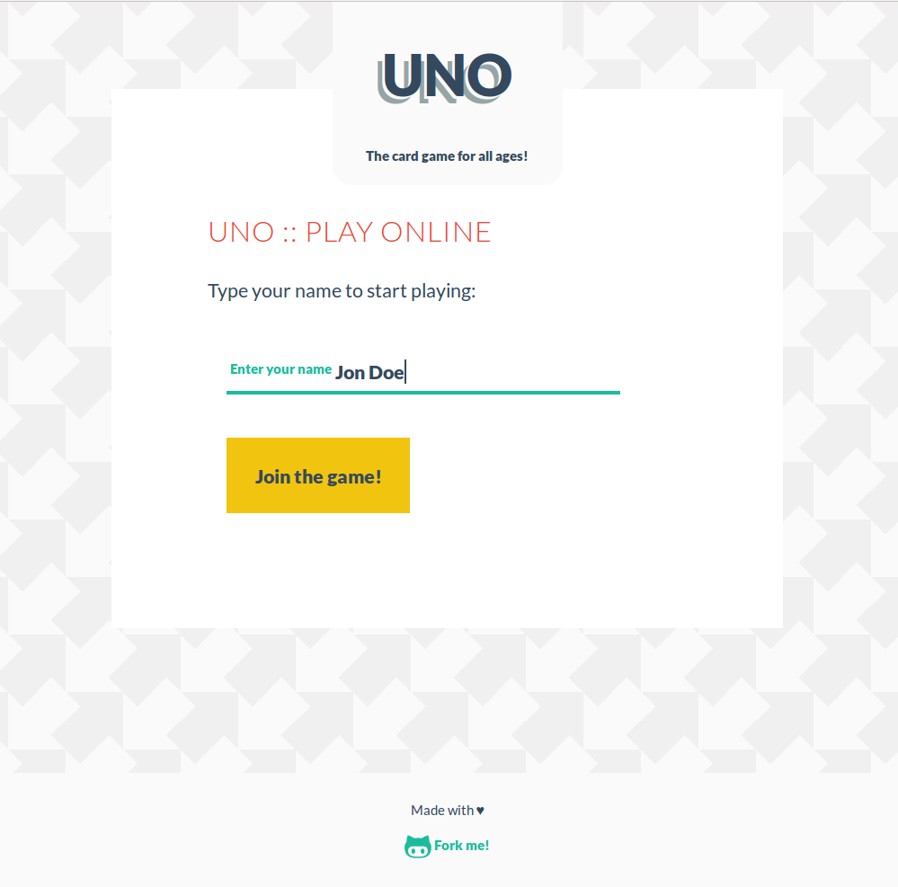

[](https://travis-ci.org/octopusinvitro/uno)
[](https://gitlab.com/me-stevens/uno/commits/master)
[](https://coveralls.io/github/octopusinvitro/uno?branch=master)

# Readme

A Sinatra implementation of the game UNO.



The business logic of the main class is extracted in a service object (`main_helper`).

* The views are used when using the app through the web.
* The `UnoClient` class is used when using the app through a terminal (for json only).
* The `UnoServer` class is the one used for both.


## How to use this project

This is a Ruby project.
You will need to tell your favourite Ruby version manager to set your local Ruby version to the one specified in the `.ruby-version` file.

For example, if you are using [rbenv](https://cbednarski.com/articles/installing-ruby/):

1. Install the right Ruby version:
```bash
$ rbenv install < VERSION >
$ rbenv rehash
```
1. Move to the root directory of this project and type:
```bash
$ rbenv local < VERSION >
$ ruby -v
```

You will also need to install the `bundler` gem, which will allow you to install the rest of the dependencies listed in the `Gemfile` file of this project.

```bash
$ gem install bundler
$ rbenv rehash
```


### Folder structure

* `bin `: Executables
* `lib `: Sources
* `spec`: Tests


### To initialise the project

```bash
$ bundle install
$ bundle exec rake
```


### To run the tests

```bash
$ bundle exec rspec --color
```


### Another way of running them

```bash
$ bundle exec rake
```


### To run the app

Make sure that the `bin/app` file has execution permissions:

```bash
$ chmod +x bin/app
```

Then just type:

```bash
$ bin/app
```

Open your browser and go to [http://localhost:4567/](http://localhost:4567/)


### Another way of running it

Update the `config.ru` file, then type

```bash
$ rerun rackup
```

Open your browser and go to [http://localhost:9292/](http://localhost:9292/)

The `rerun` gem watches for changes in your files and reloads the server.


## Sass and JavaScript

If you make changes to the CSS or JS, you have to run gulp. First, install all dependencies:

```bash
$ npm install
```

Then run gulp:

```bash
$ gulp
```

By default Sinatra will look for static files inside a `public` folder under the root directory, that's why gulp spits everything in there.


## Comments

It's funny how constants are not constant in Ruby.
In the `UnoServer` class, I had initially `MAX_PLAYERS = 4` and `MAX_CARDS = 7`.
I had to change them to `attr_reader :max_players, :max_cards` because the constants can be overwritten.


## To do

* [ ] What if a player's name already exists?
* [ ] Possible errors?
* [x] `UnoServer`'s boolean methods don't have a `?`
* [ ] Find a way to implement command-query separation in `UnoServer`'s boolean methods
* [ ] Extract the empty `<p>` tags (i.e. `join_status`) into `locals`, and the `locals` and views logic to a `presenter` object injected in the main.
* Finish the game AI implementation.
* Find a way to clean the controller, still too much business logic for my taste.
* Code climate
* Push to Heroku


## License

[](https://opensource.org/licenses/GPL-2.0)
GNU License
